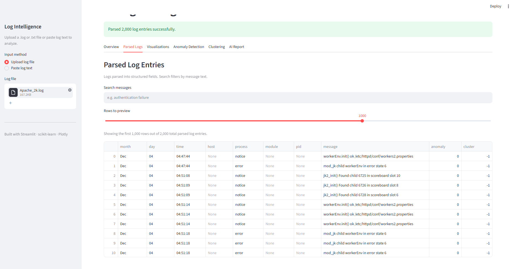
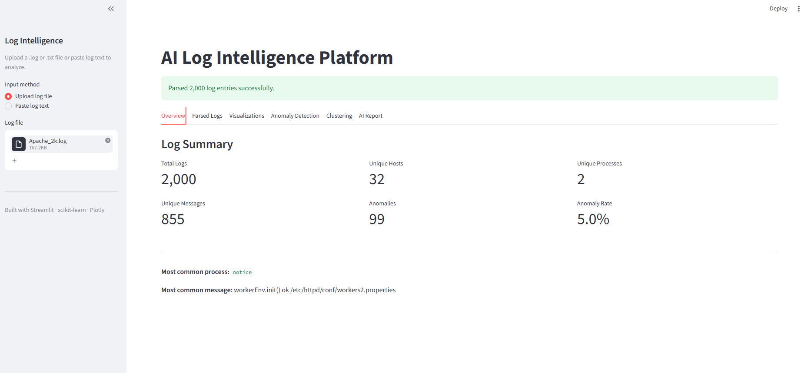
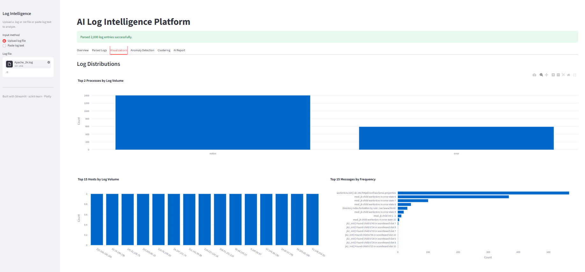
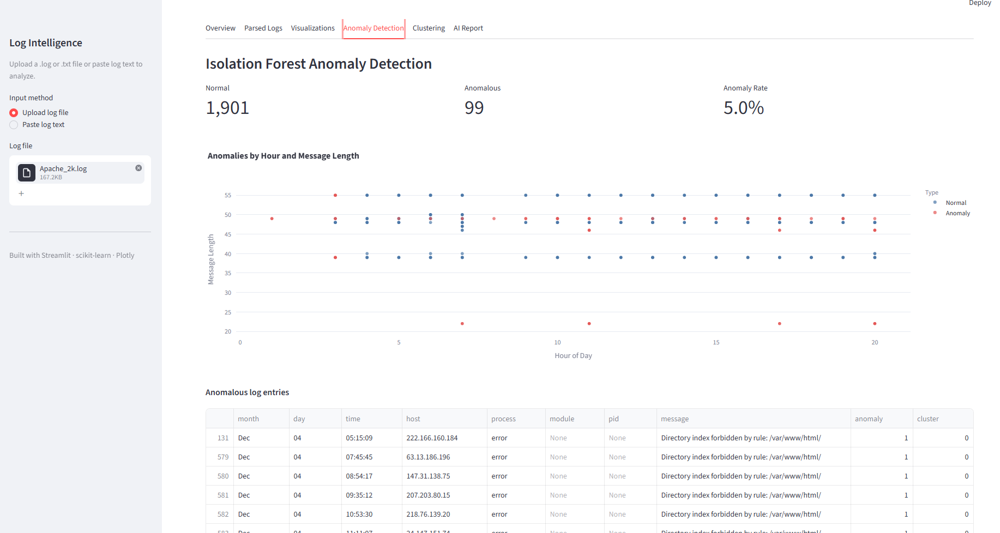
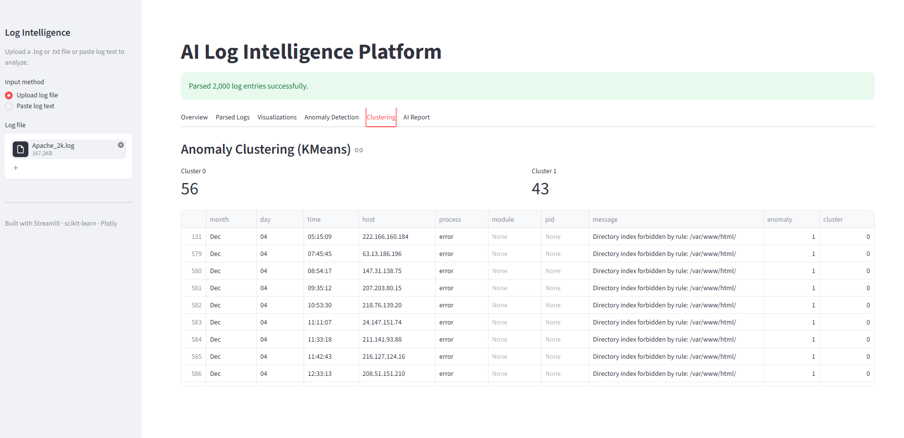
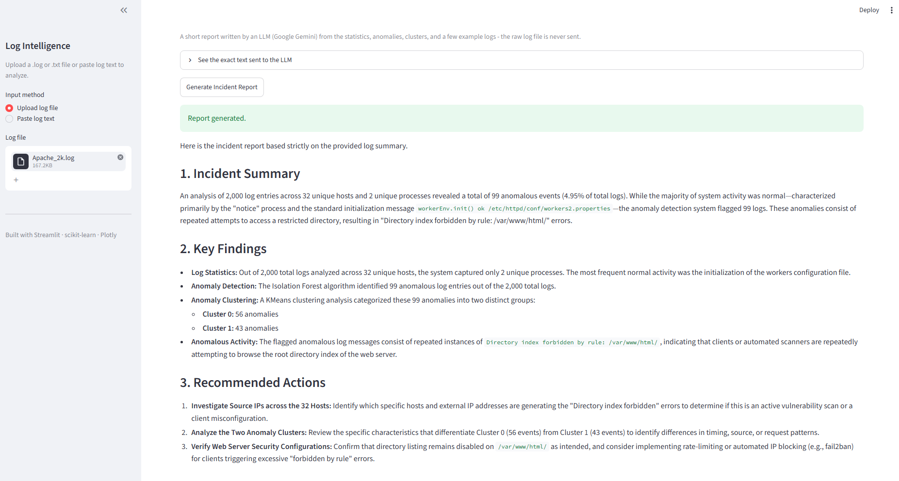

# AI Log Intelligence Platform

**Project Name:** AI Log Intelligence Platform

**Author:** Gurvir Singh

**Department:** B.Tech Computer Science and Engineering (AI and Data Science)

**College:** GNA University

**Academic Year:** 2024 – 2028

---

## Table of Contents

1. Introduction
2. Objectives
3. Features
4. Supported Log Formats
5. Technologies Used
6. Folder Structure
7. System Architecture
8. Project Workflow
9. Log Parsing
10. Data Analysis
11. Data Visualization
12. Feature Engineering
13. Isolation Forest
14. K-Means Clustering
15. LLM Incident Summary
16. User Interface
17. Test Cases
18. Limitations
19. Future Enhancements
20. Conclusion
21. Learning Outcomes
22. References

---

# 1 Introduction

## 1.1 What are log files

Almost every program running on a computer writes down what it is doing. These notes are called log files. A log file is a plain text file where each line records one event, along with the time it happened. For example, a Linux server writes a line every time someone logs in, every time a background job runs, and every time something goes wrong.

A single log line usually contains a timestamp, the name of the machine, the name of the program that wrote it, and a short message. Over time these lines add up. A busy server can produce thousands or even millions of lines in a single day.

## 1.2 Why log analysis is important

Logs are the main way to understand what has happened on a system. When a website goes down, when a server behaves strangely, or when someone tries to break in, the evidence is almost always sitting in the logs. Reading the logs is how administrators and security analysts find out what went wrong and when.

For security work this is even more important. Attacks such as repeated failed logins, brute-force attempts, or unusual activity at odd hours all leave a trail in the log files. If someone reads the logs carefully, these events can be spotted early.

## 1.3 Challenges of manual log analysis

The problem is the sheer amount of data. Reading logs by hand works fine for a few hundred lines, but it does not scale. Nobody can read a million lines a day and remember what "normal" looks like.

There are a few specific problems:

- **Volume.** There are simply too many lines to read one by one.
- **Different formats.** A Linux system log, an SSH authentication log, and an Apache web server log all look completely different. A person has to know each format.
- **Finding the unusual.** The interesting lines are rare. They are hidden among thousands of ordinary lines that all look similar.
- **Getting tired.** Reading logs is repetitive, and it is easy to miss something important after the first few hundred lines.

## 1.4 Purpose of this project

The AI Log Intelligence Platform is my attempt to make this job easier. It is a Streamlit web application that takes a log file, understands its format on its own, and turns it into a clean table. It then runs two machine learning models to find the unusual entries and group them, and it can ask a language model to write a short report explaining what it found.

The goal is not to replace a human analyst. The goal is to do the boring first pass automatically, so that a person can look at a short summary and a handful of flagged lines instead of scrolling through the whole file. In short, the project shows how Machine Learning and a Large Language Model can help someone understand a large log dataset more quickly.

---

# 2 Objectives

The main objectives of the project are:

- To accept log files in several common formats and detect the format automatically, without asking the user to pick one.
- To parse the different formats into one common table so the rest of the program does not have to care where the log came from.
- To show basic statistics about the logs, such as the total number of entries and the most common process.
- To let the user search the log messages by keyword.
- To draw simple, interactive charts that show how the logs are distributed.
- To turn the text logs into numbers so that machine learning models can work with them (feature engineering).
- To find unusual log entries automatically using the Isolation Forest algorithm.
- To group the unusual entries into clusters using K-Means, so similar problems appear together.
- To generate a short, readable incident report using a Large Language Model, based only on a summary of the results.
- To keep the whole thing simple enough to run on a normal laptop from a single command.

---

# 3 Features

This section explains each feature that is actually implemented in the project.

## 3.1 Two ways to give input

The user can either upload a `.log` or `.txt` file from the sidebar, or paste raw log text straight into a text box. Both paths feed into exactly the same analysis pipeline, so the results are identical either way. This makes it easy to try a quick example without saving it as a file first.

## 3.2 Automatic log format detection

The application does not ask the user what kind of log they are giving it. Instead it reads a sample of the first lines, tries each of its known patterns on that sample, and picks the format that matches best. If nothing matches confidently it falls back to the Linux authentication format. This means the user can simply upload a file and let the app figure out the rest.

## 3.3 Parsing into a common schema

Once the format is known, the matching parser splits each line into separate fields such as month, day, time, host, process, module, pid, and message. No matter which format was uploaded, the result always has the same core columns. This is important because every later step (statistics, charts, machine learning) can then be written once and reused for all formats.

## 3.4 Structured log table

The parsed logs are shown in a scrollable table inside the app. Instead of one long block of text, the user sees neat columns. Because very large files can be too big to send to the browser all at once, the app shows only a capped preview (the user can choose 100, 500, 1000, or 5000 rows) while still running searches over the full data.

## 3.5 Log statistics

The Overview tab shows a set of summary numbers: the total number of log entries, the number of unique hosts, the number of unique processes, the number of unique messages, the anomaly count, and the anomaly rate. It also shows the most common process and the most common message. These numbers give a quick feel for the file before looking deeper.

## 3.6 Keyword search

The Parsed Logs tab has a search box that filters the log messages by any word or phrase. The search is case-insensitive and treats the text literally, so typing special characters like brackets does not break anything. The search runs over the whole dataset, not just the visible preview.

## 3.7 Interactive charts

The Visualizations tab draws several charts using Plotly. These show the busiest processes, the busiest hosts, the most frequent messages, and a scatter plot of the anomalies. Because they are interactive, the user can hover over the bars and points to read exact values.

## 3.8 Feature engineering

Machine learning models cannot work with raw text, so the app converts the parsed logs into a purely numeric table first. Text fields such as process, module, and host are turned into numbers, and extra features such as the message length and the hour of the day are added.

## 3.9 Anomaly detection with Isolation Forest

The numeric features are passed to an Isolation Forest model, which marks each log entry as either normal or anomalous. This is an unsupervised model, so it does not need any labeled training examples. It simply learns what most of the data looks like and flags the entries that stand out.

## 3.10 Clustering with K-Means

The entries flagged as anomalies are then grouped using K-Means clustering. Similar anomalies land in the same cluster, which helps the user see whether the unusual entries fall into a small number of patterns instead of being all over the place.

## 3.11 AI incident report

The AI Report tab can send a short summary of the results to a Large Language Model (Google Gemini) and get back a written incident report. The report is split into a summary, the key findings, and a few recommended actions. Importantly, the raw log file is never sent; only the statistics, counts, cluster sizes, and a few example messages are shared.

---

# 4 Supported Log Formats

The platform detects the format automatically. The table below lists the formats it can work with. "Yes" means the current code has a parser that reads the format directly (or that an existing parser already handles it). "Planned" means the format is on the roadmap but is not parsed yet.

| Log Format | Description | Supported |
|------------|-------------|:---------:|
| Linux Syslog (RFC3164) | The traditional `Month Day HH:MM:SS host program[pid]: message` format used by systemd, the kernel, cron, and similar services. | Yes |
| Linux auth.log | Authentication events that carry a PAM `(module)` tag, such as `sshd(pam_unix)[1234]:`. | Yes |
| Linux secure | Red Hat / CentOS name for the authentication log. Same line shape as `auth.log`, so it is read by the same parser. | Yes |
| SSH Authentication Logs | SSH login successes and failures. These appear inside `auth.log`/`secure`, so they are covered by the authentication parser. | Yes |
| Apache Access Log | Web request lines in Common and Combined Log Format (client IP, method, URL, status code, size, referrer, user agent). | Yes |
| Apache Error Log | Apache 2.2 and 2.4 error lines, including the optional `[pid]` and `[client]` blocks. | Yes |
| Nginx Access Log | Nginx uses the same Combined Log Format as Apache, so the Apache access parser reads it as well. | Yes |
| Nginx Error Log | Nginx error lines use a different layout (`YYYY/MM/DD HH:MM:SS [level] ...`) that is not parsed yet. | Planned |
| RFC3164 Syslog | The BSD syslog standard. This is the same family as the Linux syslog parser above. | Yes |
| RFC5424 Syslog | The newer structured syslog standard with an ISO timestamp and version number. Not parsed yet. | Planned |
| Generic Timestamped Logs | Free-form logs that start with a timestamp but do not follow syslog structure. Only partly handled today. | Partial |

**Note:** the four dedicated parsers in the code are the Linux authentication parser, the general Linux syslog parser, the Apache access parser, and the Apache error parser. The other rows in the table are formats that either reuse one of these parsers or are listed here as planned work, so the document stays honest about what runs today.

---

# 5 Technologies Used

| Component | Technology | Purpose |
|-----------|------------|---------|
| Programming language | Python | The whole project is written in Python. |
| User interface | Streamlit | Builds the web app, the sidebar, the tabs, and the tables without writing HTML. |
| Data handling | Pandas | Stores the parsed logs as a DataFrame and does the counting and filtering. |
| Charts | Plotly (Plotly Express) | Draws the interactive bar charts and the anomaly scatter plot. |
| Machine learning | Scikit-learn | Provides the Isolation Forest and K-Means models, and the label encoder. |
| Anomaly detection | Isolation Forest | Flags each log entry as normal or anomalous. |
| Clustering | K-Means | Groups the flagged anomalies into clusters. |
| Log parsing | Python `re` (Regex) | Compiled regular expressions split each log line into fields. |
| AI report | Google Gemini (via `google-genai`) | Writes the incident report from a short summary of the results. |
| Secret handling | python-dotenv | Loads the Gemini API key from a `.env` file so it stays out of the code. |
| Version control | Git and GitHub | Tracks changes and stores the source code. |

---

# 6 Folder Structure

```
AI-Log-Intelligence-Platform/
├── app.py
├── log_parser.py
├── analyzer.py
├── search.py
├── visualizer.py
├── feature_engineering.py
├── anomaly_detector.py
├── clustering.py
├── prompt_builder.py
├── llm_summary.py
├── requirements.txt
├── README.md
├── logs/
├── screenshots/
└── log.png
```

Below is an explanation of every file.

**app.py**
This is the main file and the one that Streamlit runs. It sets up the page, builds the sidebar where the user uploads a file or pastes text, and reads the input into a single block of text. It then calls the pipeline in order: parse, build features, detect anomalies, cluster. Finally it lays out the six tabs (Overview, Parsed Logs, Visualizations, Anomaly Detection, Clustering, AI Report) and shows the results in each one. It also uses Streamlit's caching so the heavy steps do not run again on every small interaction.

**log_parser.py**
This file does all the parsing. It holds one compiled regular expression for each supported format and a detection function that decides which format the input is by counting how many sample lines match each pattern. Depending on the winner, it calls the right parser (Linux auth.log, general syslog, Apache access, or Apache error). Every parser returns a Pandas DataFrame with the same core columns, so the rest of the app does not need to know which format was used. It also has small helper functions for splitting timestamps and cleaning optional fields.

**analyzer.py**
This file calculates the summary statistics shown on the Overview tab. Given the parsed DataFrame, it returns a dictionary with values such as the total number of logs, the number of unique hosts and processes, the number of unique messages, and the most common process and message. It deliberately leaves the per-host and per-process breakdowns to the charts, so it stays small.

**search.py**
This file has a single function that filters the logs by a search term. It looks inside the message column for the term, ignoring upper and lower case, and treats the term as plain text rather than a pattern. That way typing characters like `(` or `*` filters literally instead of causing an error. If the search box is empty it returns the data unchanged.

**visualizer.py**
This file builds the Plotly charts. It has functions for the top processes, the top hosts, and the most frequent messages (all bar charts), plus a scatter plot that shows anomalies by hour and message length. For very large inputs the scatter plot samples the normal points down while keeping all the anomalies, so the chart stays fast to draw.

**feature_engineering.py**
This file turns the parsed text logs into a numeric table the models can use. It label-encodes the process, module, and host columns, measures the length of each message, extracts the hour from the time field, and converts the pid to a number. Both the time and pid conversions are error-tolerant, so a single bad line becomes a zero instead of crashing the whole pipeline.

**anomaly_detector.py**
This file runs the Isolation Forest model. It takes the numeric feature table, trains the model, and adds an `anomaly` column that is 1 for anomalies and 0 for normal rows. It always works on a copy of the data so the original is never changed, which makes it safe to cache.

**clustering.py**
This file runs K-Means on the anomalies only. It adds a `cluster` column to the data; normal rows (and the case where there are too few anomalies to cluster) get a value of `-1`. If there are fewer anomalies than the requested number of clusters, it safely skips clustering instead of failing.

**prompt_builder.py**
This file builds the text prompt that is sent to the language model. It takes the statistics, the full table, and the anomalies, and writes a short, clearly labelled summary containing the statistics, the anomaly count, the cluster sizes, and up to five example anomalous messages. It never includes the raw log file. Keeping this in its own file makes it easy to see exactly what the model receives.

**llm_summary.py**
This file has one job: send a prompt to Google Gemini and return the answer as text. It reads the API key from the environment (loaded from a `.env` file), creates the client, sends the prompt, and returns the generated report. It knows nothing about logs or DataFrames, which keeps it simple and easy to test.

**requirements.txt**
This file lists the Python packages the project needs, with minimum versions: Streamlit, Pandas, scikit-learn, Plotly, tiktoken, google-genai, and python-dotenv. Installing from this file sets up everything in one command.

**README.md**
This is the short guide for anyone who opens the repository on GitHub. It explains what the project does, how to install and run it, the supported formats, and the project structure in a compact form.

**logs/**
A folder for sample log files so the app can be tried out quickly without hunting for real logs.

**screenshots/**
A folder that holds the screenshots used in this document and in the README.

**log.png**
The small image used as the browser tab icon for the Streamlit app.

---

# 7 System Architecture

The application is a straight pipeline. Data enters at the top as raw text and flows down through each stage, gaining more structure and meaning as it goes. The diagram below shows the full path.

```
                 User
                  |
                  v
         Upload Log / Paste Text
                  |
                  v
        Automatic Log Detection
                  |
                  v
                Parser
                  |
                  v
           Structured Data
                  |
        +---------+---------+
        |                   |
        v                   v
     Analyzer          Visualizations
   (statistics)       (Plotly charts)
                  |
                  v
        Feature Engineering
                  |
                  v
          Isolation Forest
        (anomaly detection)
                  |
                  v
             K-Means
          (clustering)
                  |
                  v
          Prompt Builder
                  |
                  v
        LLM (Google Gemini)
                  |
                  v
        AI Incident Summary
```

**Explanation of each component:**

- **User.** The person using the app. They start everything by providing a log file or pasting log text.
- **Upload Log / Paste Text.** The Streamlit sidebar takes the input and turns it into one block of raw text. Both input methods end up here.
- **Automatic Log Detection.** A sample of the first lines is tested against every known pattern, and the best-matching format is chosen automatically.
- **Parser.** The parser for the detected format splits each line into fields and returns a table with the common columns.
- **Structured Data.** The clean, tabular version of the logs. Everything after this point reads from this table.
- **Analyzer.** Reads the structured data and produces the summary numbers shown on the Overview tab.
- **Visualizations.** Reads the same structured data and produces the charts.
- **Feature Engineering.** Converts the structured text data into a purely numeric feature table.
- **Isolation Forest.** Uses the numeric features to flag each entry as normal or anomalous.
- **K-Means.** Groups the flagged anomalies into clusters.
- **Prompt Builder.** Turns the statistics, anomaly counts, cluster sizes, and a few example messages into a short text prompt.
- **LLM (Google Gemini).** Reads the prompt and writes an incident report in plain English.
- **AI Incident Summary.** The final written report shown to the user.

---

# 8 Project Workflow

This section walks through what happens from start to finish when someone uses the app.

**Step 1 – The user provides input.** The user opens the app and either uploads a `.log`/`.txt` file from the sidebar or pastes log text into the text area. If nothing is provided, the app shows a friendly message and waits.

**Step 2 – The text is read.** The uploaded file is decoded to text (bad bytes are replaced instead of crashing), or the pasted text is used directly. Either way the result is one string of raw log lines.

**Step 3 – The format is detected and the logs are parsed.** The app samples the first lines, decides which format the log is, and runs the matching parser. If no line matches a known format, the app shows a warning explaining the expected shape and stops. Otherwise it reports how many entries were parsed.

**Step 4 – Features are engineered.** The parsed table is converted into a numeric feature table (encoded categories plus message length, hour, and pid). This step is cached so it does not repeat unnecessarily.

**Step 5 – Anomalies are detected.** The Isolation Forest model runs on the feature table and marks each row as normal or anomalous.

**Step 6 – Anomalies are clustered.** K-Means groups the anomalous rows into clusters. Normal rows are left with a cluster value of `-1`.

**Step 7 – Results are shown in tabs.** The Overview tab shows the statistics and anomaly rate. The Parsed Logs tab shows the table and the search box. The Visualizations tab shows the charts. The Anomaly Detection tab shows the flagged rows and the scatter plot. The Clustering tab shows the size of each cluster and the grouped anomalies.

**Step 8 – (Optional) The AI report is generated.** On the AI Report tab, the app builds the prompt and shows the user the exact text that will be sent. If the user clicks the button and an API key is set, the summary goes to Google Gemini and the written report is displayed.

---

# 9 Log Parsing

Parsing is the heart of the project, because everything else depends on getting clean, structured data out of messy text.

## 9.1 Automatic log detection

The user never has to say what type of log they are uploading. The parser takes a sample of the first non-empty lines (up to twenty) and counts how many of them match each known pattern. The format with the most matches wins. There are a couple of sensible rules built in: an Apache format is only chosen when it clearly beats the syslog family, and if nothing matches well the app falls back to the Linux authentication parser. This "voting" approach is simple and works well for real files, which are usually all one format.

## 9.2 Regex parsing

Each format has its own compiled regular expression. A regular expression is a pattern that describes the shape of a line, for example "three-letter month, then a day number, then a time, then a host name, and so on." The patterns are compiled once when the program starts, not on every run, which keeps things fast. Each parser goes through the lines one at a time, applies its pattern, and pulls out the named fields.

## 9.3 Common schema

Even though the formats look very different, every parser produces the same core columns: month, day, time, host, process, module, pid, and message. Fields that a particular format does not have are simply set to `None`. For example, an Apache access log has no "process" in the Linux sense, so the HTTP method is mapped into that column, the status code into the module column, and so on. This mapping is what lets a single statistics function, a single set of charts, and a single machine learning pipeline work for every format.

## 9.4 Parser compatibility

Because every format flows into the same schema, adding a new format only means writing a new pattern and a small parser that fills the common columns. Nothing downstream has to change. This is why the Apache access parser can also read Nginx access logs for free — they share the same Combined Log Format.

## 9.5 Error handling

The parser is written to never crash on bad input. Lines that do not match a pattern are skipped rather than raising an error. Timestamps that are malformed become empty strings instead of stopping the program. If the whole file matches nothing, the parser returns an empty table and the app shows a clear warning. This means a single strange line in a large file cannot take the whole analysis down.

---

# 10 Data Analysis

## 10.1 Statistics generation

The analyzer reads the parsed table and produces a small set of summary numbers. These are:

- **Total Logs** – how many entries were parsed.
- **Unique Hosts** – how many different machines appear.
- **Unique Processes** – how many different programs appear.
- **Unique Messages** – how many distinct message texts appear.
- **Most Common Process** – the program that wrote the most lines.
- **Most Common Message** – the single message text that appears most often.

The app also adds the anomaly count and the anomaly rate (the percentage of entries flagged as anomalies) to this view. Together these numbers give a fast overview of the file before digging into details.

## 10.2 Search functionality

The Parsed Logs tab has a search box that filters the entries by their message text. The search is case-insensitive, so "Failed" and "failed" both match, and it treats the typed text literally, so brackets and other symbols are safe. If the box is empty, all entries are shown.

## 10.3 Filtering

An important design point is that the search runs over the whole dataset, not just the rows currently visible. The table only shows a capped preview (chosen by the user from 100 up to 5000 rows) so that large files do not overload the browser, but the filtering happens on the full data first and the count of matches is shown. This keeps the app responsive even on big logs while still searching everything.

---

# 11 Data Visualization

All charts are built with Plotly Express, so they are interactive: hovering over a bar or point shows the exact value. There are four charts.

## 11.1 Top processes by log volume

- **Purpose:** show which programs are the noisiest, since a program writing far more lines than usual is often worth a look.
- **Input:** the process column of the parsed logs.
- **Output:** a vertical bar chart of the top fifteen processes, sorted by how many lines each one wrote.

## 11.2 Top hosts by log volume

- **Purpose:** show which machines produced the most log lines, which helps when several servers write to the same file.
- **Input:** the host column of the parsed logs.
- **Output:** a vertical bar chart of the top fifteen hosts by line count.

## 11.3 Top messages by frequency

- **Purpose:** show which exact messages repeat the most, because a message appearing thousands of times can point to a loop, a misconfiguration, or an attack.
- **Input:** the message column of the parsed logs.
- **Output:** a horizontal bar chart of the top fifteen messages. The message text is shortened to sixty characters so the labels stay readable.

## 11.4 Anomalies by hour and message length

- **Purpose:** show where the anomalies sit compared to the normal entries, so patterns are easy to see at a glance.
- **Input:** the feature table, using the hour and message length columns plus the anomaly flag.
- **Output:** a scatter plot with hour of day on the x-axis and message length on the y-axis. Normal points are one colour and anomalies another. For very large files the normal points are sampled down while every anomaly is kept, so the chart stays fast without hiding the important points.

---

# 12 Feature Engineering

Machine learning models only understand numbers, but logs are mostly text. Feature engineering is the step that bridges this gap by turning each parsed log line into a row of numbers. The final feature table has six columns: process, module, host, pid, message length, and hour.

## 12.1 Label Encoding

Label encoding gives each distinct text value its own whole number. For example, if the process column contains `sshd`, `cron`, and `systemd`, these might become 0, 1, and 2. This lets the models treat categories as numbers. In this project label encoding is applied to the process, module, and host columns.

## 12.2 Process encoding

The process column (the program that wrote each line) is label-encoded. This matters because different programs behave differently, and an entry from a program that rarely appears can be a sign of something unusual.

## 12.3 Module encoding

The module column (for example the PAM module in an authentication log, or the status code mapped from an Apache log) is also label-encoded. It adds another dimension the model can use to tell entries apart. Where a format has no module, the value is filled in before encoding so the step never fails.

## 12.4 Host encoding

The host column (the machine name) is label-encoded too. If logs from several machines are mixed together, a line from an unexpected host can stand out.

## 12.5 Message length

Instead of feeding the raw message text to the model, the app measures how long each message is and uses that number. This is a simple but useful signal: error messages and stack traces are often much longer or shorter than normal informational lines.

## 12.6 Hour extraction

The hour of the day is pulled out of the time field and used as a feature. Time of day matters for security: a burst of activity at three in the morning is more suspicious than the same activity during working hours. If a time cannot be read it becomes zero instead of causing an error.

## 12.7 PID

The process id (pid) is converted from text to a number. Values that are missing or cannot be converted become zero. On its own the pid is a weak signal, but it adds a little extra information for the model.

## 12.8 Why these features are required

The models cannot look at a log line and understand it the way a person does. They can only compare numbers. By choosing features that capture *who* wrote the line (process, host), *what kind* of line it is (module, message length), *when* it happened (hour), and *which instance* wrote it (pid), the app gives the models enough to tell an ordinary line from an unusual one. Good features are what make the anomaly detection meaningful; with poor features the model would just flag noise.

---

# 13 Isolation Forest

## 13.1 What it is

Isolation Forest is a machine learning algorithm used to find outliers, meaning data points that are different from the rest. It is *unsupervised*, so it does not need any examples labelled as "normal" or "anomalous" to learn from. This is a great fit for logs, because in real life nobody has time to label thousands of log lines by hand.

## 13.2 Why it was selected

I chose Isolation Forest for a few reasons. First, log anomalies are rare and unlabelled, which rules out models that need labelled training data. Second, it is fast and works well even when there are a lot of rows. Third, it is included in scikit-learn, so it is easy to use and well documented. It matched the problem better than trying to write detection rules by hand.

## 13.3 Working principle

The idea behind Isolation Forest is clever and simple. It builds many random trees. At each step a tree picks a feature at random and splits the data at a random value. Points that are unusual get separated from the rest after only a few splits, because there is nothing similar around them. Ordinary points, which sit in crowded areas, take many more splits to isolate. The model measures how quickly each point gets isolated on average, and the points that isolate quickly are marked as anomalies. In this project the model is told to expect about five percent of the data to be anomalies.

## 13.4 Advantages

- It does not need labelled data.
- It is fast and handles large datasets well.
- It works with several features at once, not just one.
- It gives a clear yes/no answer for every log entry.

## 13.5 Limitations

- The "five percent anomalies" assumption is a guess; if the real rate is very different, the results shift.
- Because it is unsupervised, there is no accuracy score to check against.
- The quality of the results depends heavily on the features. Weak features mean weak detection.
- It flags "different", which is not always the same as "bad". A human still has to look at the flagged lines.

## 13.6 Role in this project

Isolation Forest is the step that narrows a huge file down to a short list of interesting entries. It takes the numeric feature table, marks each row as normal or anomalous, and this flag then drives the anomaly tab, the scatter plot, the clustering step, and the summary sent to the language model.

## 13.7 Workflow diagram

```
        Numeric Feature Table
                  |
                  v
     Train Isolation Forest
   (100 random trees, ~5% rate)
                  |
                  v
   Score every row by how fast
        it gets isolated
                  |
                  v
      Mark each row: 1 = anomaly,
              0 = normal
                  |
                  v
     Anomaly column added to data
```

---

# 14 K-Means Clustering

## 14.1 What it is

K-Means is a clustering algorithm. Clustering means grouping data points so that points in the same group are similar to each other. K-Means splits the data into a chosen number of groups, called clusters. In this project it is used only on the entries that Isolation Forest already flagged as anomalies.

## 14.2 Working principle

K-Means works in a loop. First it picks a number of centre points. Then it assigns every data point to the nearest centre, forming clusters. Next it moves each centre to the average position of the points assigned to it. It repeats the assign-and-move steps until the centres stop moving much. The result is a set of groups where each point belongs to the nearest centre. In this project the default is two clusters.

## 14.3 Why clustering is useful

Finding the anomalies is only half the job. Once you have a list of unusual entries, you still want to know whether they are all the same kind of problem or several different problems. Clustering answers this. If all the anomalies fall into one cluster, they are probably one issue. If they split into two clear groups, there may be two separate things going on. This turns a flat list into something with structure.

## 14.4 Advantages

- It is simple to understand and quick to run.
- It gives each anomaly a group label that is easy to read.
- It helps reveal patterns that a flat list of anomalies hides.
- It is included in scikit-learn and needs very little setup.

## 14.5 Limitations

- The number of clusters has to be chosen in advance; here it is fixed at two.
- It can behave oddly if there are very few anomalies, so the app skips clustering when there are fewer anomalies than clusters.
- The results depend on the starting positions of the centres, although a fixed random seed keeps them repeatable.
- It assumes clusters are roughly round and similar in size, which is not always true.

## 14.6 Role in this project

K-Means takes the anomalies from the Isolation Forest step and gives each one a cluster number. Normal entries are left with a cluster value of `-1`. The Clustering tab then shows how big each cluster is, and the cluster sizes are also included in the summary sent to the language model, so the report can mention whether the anomalies grouped together or spread out.

## 14.7 Workflow diagram

```
        Anomalous Rows Only
                  |
                  v
      Enough anomalies to cluster?
          |               |
         No               Yes
          |               |
          v               v
   Skip (all get     Run K-Means
   cluster = -1)     (default 2 clusters)
                          |
                          v
              Assign each anomaly a
                 cluster number
                          |
                          v
            Cluster column added to data
```

---

# 15 LLM Incident Summary

The final feature uses a Large Language Model (Google Gemini) to write a short incident report in plain English. This part is split into two files so it is easy to explain and change.

## 15.1 Prompt Builder

The prompt builder is the file that decides *what information* the model gets. It does not send the raw log file. Instead it builds a short, clearly labelled text summary that contains:

- the basic statistics (total logs, unique hosts, unique processes, most common process and message),
- the number of anomalies found by Isolation Forest,
- the size of each K-Means cluster,
- and up to five example anomalous messages, each cut to a safe length.

It then adds an instruction telling the model to write the report in three parts: a short summary, the key findings, and two or three recommended actions. Keeping all of this in one file means anyone can read it and see exactly what is being shared.

## 15.2 LLM Summary Generator

The summary generator has a single job: take the prompt, send it to Google Gemini, and return the answer as text. It reads the API key from the environment (loaded from a `.env` file so the key never sits in the code), creates the client, sends the prompt, and returns the report. It knows nothing about logs or DataFrames, which keeps it small and easy to test on its own.

## 15.3 How the prompt is created

When the user opens the AI Report tab, the app recalculates the statistics, gathers the anomalies, and calls the prompt builder to assemble the summary described above. The exact text that will be sent is shown to the user inside an expandable box, so there are no surprises about what leaves the machine.

## 15.4 How the response is displayed

If the user clicks the "Generate Incident Report" button and a valid API key is set, the prompt is sent to Gemini while a spinner shows that work is happening. The returned report is then displayed as formatted text on the page. If anything goes wrong — a missing key or a network error — the app shows a clear error message instead of crashing.

## 15.5 Benefits

- It turns numbers and flags into a readable explanation a person can act on.
- It saves time by writing the first draft of an incident summary automatically.
- It only shares a small, controlled summary, not the whole log file, which is better for privacy.
- The three-part format (summary, findings, actions) is consistent and easy to read.

## 15.6 Limitations

- It needs an internet connection and a valid Gemini API key.
- The report is only as good as the summary it receives; the model does not see the full logs.
- A language model can occasionally state things that are not exactly right, so the report should be checked, not trusted blindly.
- Using the online model has usage limits and depends on an outside service.

---

# 16 User Interface

The app opens with a title, a sidebar for input, and six tabs across the top. Each tab is a separate page of results. The screenshots below are placeholders; real images can be added to the `screenshots` folder.

## 16.1 Sidebar and input

The sidebar is where everything starts. The user chooses between uploading a file and pasting text, then provides the log. A short caption explains what to do.


## 16.2 Parsed Logs tab

This tab shows the structured table with the search box above it. The user can search messages by keyword and choose how many rows to preview.



## 16.3 Overview tab

This tab shows the summary numbers as metric cards: total logs, unique hosts, unique processes, unique messages, anomaly count, and anomaly rate, along with the most common process and message.



## 16.4 Visualizations tab

This tab shows the Plotly charts: top processes, top hosts, top messages, and the anomaly scatter plot. The charts are interactive.



## 16.5 Anomaly Detection tab

This tab shows how many entries were normal versus anomalous, the anomaly rate, the scatter plot, and a table of just the anomalous entries.



## 16.6 Clustering tab

This tab shows the size of each cluster as metric cards and a table of the anomalies sorted by their cluster number.



## 16.7 AI Report tab

This tab shows the exact prompt that will be sent (inside an expander) and a button to generate the report. The generated report appears below the button.



---

# 17 Test Cases

The table below lists some of the tests I ran to check that the main parts of the app behave as expected.

| Test Case ID | Objective | Input | Expected Result | Actual Result | Status |
|:---:|-----------|-------|-----------------|---------------|:---:|
| TC-01 | Parse a valid Linux auth.log file | An `auth.log` file with several SSH and sudo lines | The lines are parsed into the table and the count is shown | Lines parsed correctly and count shown | Pass |
| TC-02 | Detect an Apache access log automatically | An Apache access log pasted into the text box | The app detects the Apache format and fills the table | Format detected and table filled | Pass |
| TC-03 | Handle an unsupported / empty file | A file with random text that matches no format | The app shows a warning and stops instead of crashing | Warning shown, no crash | Pass |
| TC-04 | Search the log messages | Search term "failed" on a parsed auth.log | Only entries containing "failed" are shown with a match count | Matching rows and count shown | Pass |
| TC-05 | Flag anomalies with Isolation Forest | A log file with a few unusual lines | A small percentage of entries are marked as anomalies | Anomalies flagged and listed | Pass |
| TC-06 | Cluster the anomalies | A file with several anomalies | The anomalies are split into clusters and sizes are shown | Clusters formed and sizes shown | Pass |
| TC-07 | Generate the AI report with no API key | Click "Generate Incident Report" without a key set | A clear error message is shown, app keeps running | Error message shown, no crash | Pass |
| TC-08 | Generate the AI report with a valid key | Click the button with a valid Gemini key set | A three-part report is displayed | Report displayed | Pass |

---

# 18 Limitations

Like any student project, this one has limits worth being honest about.

- **Offline analysis only.** The app works on files that are uploaded or pasted. It does not watch live log streams as they are written.
- **Depends on the uploaded file.** The results are only as good as the file provided. It cannot analyse logs it has not been given.
- **Slower on very large files.** The whole file is loaded into memory, so extremely large logs are limited by the available RAM and take longer to process.
- **Detection quality depends on features.** The anomaly detection is only as good as the engineered features. Better features would mean better results, and the current set is fairly simple.
- **No accuracy score.** Because the models are unsupervised, there is no ground truth to measure against. The flags are suggestions, not certainties.
- **Some formats are not parsed yet.** Nginx error logs and RFC5424 syslog are listed as planned, not supported.
- **The AI report needs the internet.** It requires a network connection and a valid API key, and it depends on an outside service.

---

# 19 Future Enhancements

There are many ways this project could grow:

- **Windows Event Logs** – add support for the Windows event log format.
- **Docker Logs** – parse container logs from Docker.
- **Kubernetes Logs** – handle pod and container logs from a Kubernetes cluster.
- **Firewall Logs** – add patterns for common firewall log formats.
- **Real-time monitoring** – watch a log file as it grows instead of analysing a fixed file.
- **Email alerts** – send an email when a serious anomaly is detected.
- **Database integration** – store parsed logs and results in a database for later use.
- **Historical comparison** – compare today's logs with previous days to spot changes.
- **SOC dashboard** – build a single monitoring dashboard that brings several sources together.
- **Threat intelligence integration** – check suspicious IP addresses against known threat lists.
- **Nginx error and RFC5424 parsers** – finish the formats currently listed as planned.
- **Report export** – save the AI report and the results to a PDF or file.

---

# 20 Conclusion

The AI Log Intelligence Platform started from a simple observation: there are far too many log lines for a person to read, and the interesting ones are hidden among thousands of ordinary lines. The project set out to make that first pass easier by letting a computer do the tedious work of reading, sorting, and flagging, so a human can focus on the small part that actually matters.

The final application does this in a clear, step-by-step way. A user gives it a log file or pastes some text, and the app figures out the format on its own. It parses the messy text into a clean table, no matter which of the supported formats the log came from, and it puts everything behind one common set of columns so the rest of the program stays simple. From there it shows the basic statistics, lets the user search, and draws a few charts that give a quick feel for the data.

The machine learning part is where the project goes beyond a plain viewer. Feature engineering turns the text logs into numbers, Isolation Forest flags the entries that stand out, and K-Means groups those entries so similar problems appear together. None of this needs labelled training data, which matters because real logs almost never come with labels. Finally, the language model turns the numbers and flags into a short written report with a summary, the key findings, and a few suggested actions, while being careful to share only a small summary and never the raw file.

Building the project taught me how the pieces of a data pipeline fit together, from raw text all the way to a written report. It also taught me the value of keeping each step in its own small file, so the whole thing is easy to read, test, and explain. The result is not a finished commercial tool, and it is not meant to be. It is a working demonstration of how machine learning and a language model can help someone make sense of a large pile of logs, and a solid base that I could keep improving with the enhancements listed above. Overall, the project met the objectives I set at the start, and it gave me practical experience with the tools and ideas behind modern log analysis.

---

# 21 Learning Outcomes

While building this project I learned a number of things, both technical and practical:

- **Regular expressions.** I learned how to write and read regex patterns to pull structured fields out of messy text, and how to handle optional pieces that some lines have and others do not.
- **Automatic format detection.** I learned a simple, reliable way to guess a file's format by counting matches on a sample, instead of forcing the user to choose.
- **Working with Pandas.** I got comfortable storing data in DataFrames and using them to count, filter, and summarise.
- **A common schema.** I learned why mapping different inputs into one shared set of columns keeps the rest of a program simple, and how much work it saves later.
- **Feature engineering.** I learned how to turn raw text into numeric features and why the choice of features decides how well a model performs.
- **Unsupervised learning.** I learned how Isolation Forest finds outliers without labelled data and how K-Means groups similar points.
- **Reading model results critically.** I learned that "anomalous" means "different", not always "bad", and that a human still needs to check the output.
- **Building a web app with Streamlit.** I learned how to lay out a sidebar, tabs, tables, and metrics, and how caching avoids repeating slow work.
- **Interactive charts with Plotly.** I learned how to build charts that let the user hover for exact values, and how to keep them fast on large data by sampling.
- **Calling an LLM safely.** I learned how to build a controlled prompt, how to send it to an API, and how to keep the API key out of the source code using environment variables.
- **Writing clean, separated code.** I learned to keep each responsibility in its own small file, which made the whole project easier to understand and to document.
- **Using Git and GitHub.** I practised tracking changes and keeping the project's history in version control.

---

# 22 References

- Python Documentation — https://docs.python.org/3/
- Streamlit Documentation — https://docs.streamlit.io/
- Pandas Documentation — https://pandas.pydata.org/docs/
- Scikit-learn Documentation — https://scikit-learn.org/stable/documentation.html
- Scikit-learn Isolation Forest — https://scikit-learn.org/stable/modules/generated/sklearn.ensemble.IsolationForest.html
- Scikit-learn K-Means — https://scikit-learn.org/stable/modules/generated/sklearn.cluster.KMeans.html
- Plotly Python Documentation — https://plotly.com/python/
- Google Gemini API / google-genai — https://ai.google.dev/
- Linux Syslog Documentation — https://man7.org/linux/man-pages/man5/syslog.conf.5.html
- RFC 3164 — The BSD Syslog Protocol — https://www.rfc-editor.org/rfc/rfc3164
- RFC 5424 — The Syslog Protocol — https://www.rfc-editor.org/rfc/rfc5424
