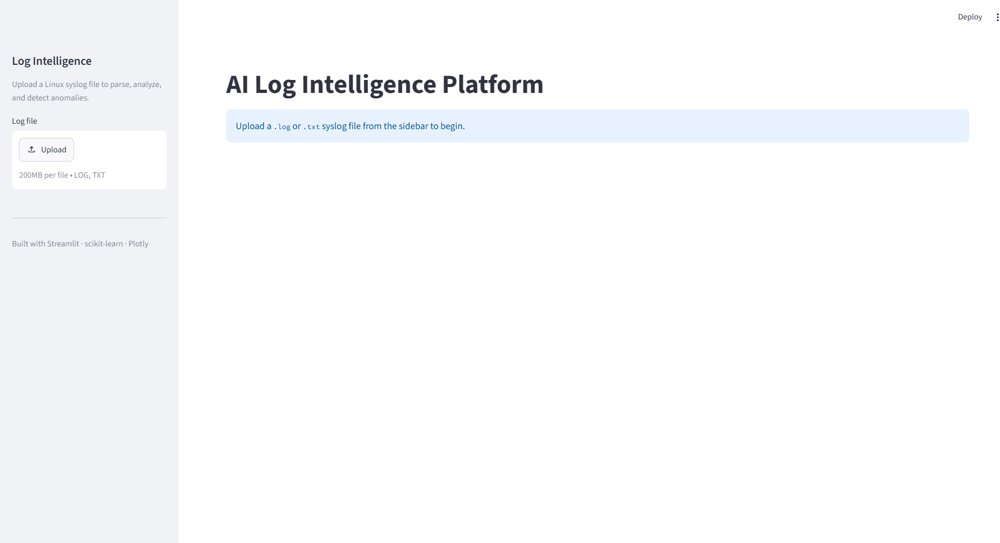
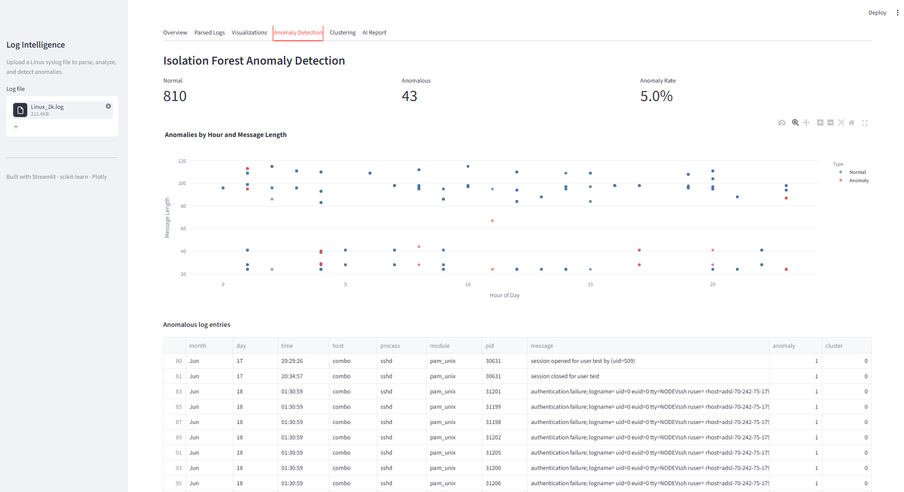

# AI Log Intelligence Platform

## Overview

AI Log Intelligence Platform is a Streamlit application for analyzing Linux system log files. You upload a log file and the app parses it into a structured table, shows some basic statistics, draws a few charts, and then uses two machine learning models to find and group unusual log entries.

The anomaly detection is done with Isolation Forest, and the anomalies are grouped using K-Means clustering. There is also an optional tab that asks a language model (Google Gemini) to write a short incident report based on the results.

I built this as my final-year project to learn how machine learning can be applied to log analysis and to get some practice with the tools listed below.

## Features

- Upload Linux log files (.log or .txt)
- Parse the Linux syslog format into structured fields
- Display the parsed log entries in a table
- Basic log statistics (totals, unique hosts, unique processes, and so on)
- Search log messages by keyword
- Interactive charts built with Plotly
- Feature engineering to prepare the data for the models
- Anomaly detection with Isolation Forest
- Clustering of anomalies with K-Means
- Optional AI-generated incident report using Google Gemini

## Project Workflow

These are the main steps the app goes through, from upload to clustering:

```
Upload Log File
      ↓
Parse Logs
      ↓
Generate Statistics
      ↓
Visualize Logs
      ↓
Feature Engineering
      ↓
Anomaly Detection
      ↓
Clustering
```

## Technologies Used

- Python
- Streamlit (user interface)
- Pandas (data handling)
- Scikit-learn (Isolation Forest and K-Means)
- Plotly (charts)
- Regex, using Python's re module (log parsing)
- Google Gemini through the google-genai package (optional incident report)
- python-dotenv (to load the API key from a .env file)

## Installation

You need Python 3.11 or newer.

```
git clone <your-repository-url>
cd AI-Log-Intelligence-Platform
pip install -r requirements.txt
streamlit run app.py
```

The app opens in your web browser.

The AI Report tab needs a Gemini API key. If you want to use it, copy the example environment file to a new file named .env:

```
GOOGLE_API_KEY=your_api_key_here
```

A free key can be created from Google AI Studio. The rest of the app works without a key, so this step is only needed for the report.

## How to Use

1. Start the app with streamlit run app.py.
2. Upload a log file from the sidebar. A sample file is included in the logs folder if you just want to try it out.
3. Open the Overview tab to see the statistics.
4. Open the Parsed Logs tab to see the structured entries. You can also search messages here.
5. Open the Visualizations tab to see the charts.
6. Open the Anomaly Detection tab to see which entries were flagged as unusual.
7. Open the Clustering tab to see how the anomalies were grouped.
8. (Optional) Open the AI Report tab. If your API key is set, click the button to generate a written summary.

## Project Structure

- app.py — the main Streamlit app. It handles the upload, runs the pipeline, and builds the tabbed interface.
- log_parser.py — reads the raw log text and uses a regular expression to split each line into fields.
- analyzer.py — calculates the summary statistics from the parsed logs.
- search.py — filters the log messages by a search term.
- visualizer.py — builds the Plotly charts (process, host, message, and anomaly plots).
- feature_engineering.py — turns the parsed logs into numeric features for the models.
- anomaly_detector.py — runs Isolation Forest and marks each entry as normal or anomalous.
- clustering.py — runs K-Means to group the anomalies into clusters.
- prompt_builder.py — builds the text summary that is sent to the language model.
- llm_summary.py — sends that summary to Google Gemini and returns the incident report.
- requirements.txt — the list of Python packages.
- README.md — this file.

## Machine Learning Pipeline

```
Feature Engineering
      ↓
Isolation Forest
      ↓
K-Means
```

Feature engineering takes the parsed logs, which are mostly text, and turns them into numbers the models can use. The process, module, and host names are label encoded, and a few extra features are added, such as the message length and the hour taken from the timestamp.

Isolation Forest is an unsupervised model, which means it does not need labeled examples. It works by randomly splitting the data and measuring how easily each point can be separated from the rest. Points that are separated quickly are treated as anomalies.

K-Means then takes only the anomalies and groups them into clusters, so that similar anomalies end up together. This makes it easier to see whether the unusual entries fall into a small number of patterns.

## Sample Screenshots

The screenshots below are placeholders. Add your own images to a screenshots folder and they will show up here.





## Future Improvements

- Support more log formats instead of only this one syslog pattern
- Improve the anomaly detection, for example by tuning the parameters or trying other methods
- Let the user choose the number of clusters
- Export the results and the report to a file
- Add live or real-time log monitoring

## Learning Outcomes

Some of the things I learned while building this project:

- Writing regular expressions to parse text
- Cleaning and organizing data with Pandas
- Turning raw data into features for machine learning
- How Isolation Forest can be used for anomaly detection
- How K-Means clustering groups similar data
- Building an interactive app with Streamlit
- Creating charts with Plotly
- Calling a language model API and keeping the API key out of the code

## Limitations

- It only supports the Linux syslog format that matches the parser's pattern. Lines in other formats are skipped.
- It works on uploaded files, not on live log streams.
- The anomaly detection is unsupervised and assumes that a small percentage of the logs are anomalies. There is no accuracy score, and the results depend a lot on the input data.
- The whole file is loaded into memory, so very large files are limited by the available RAM.
- The AI Report tab needs an internet connection and a valid Gemini API key.

## Author

Name: Gurvir Singh

Course: Btech CSE (AI/DS)

GitHub: https://github.com/GurvirSinghH
